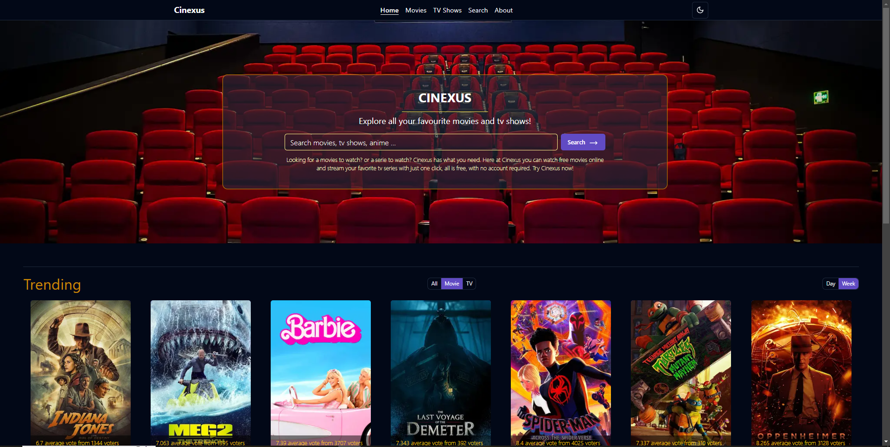
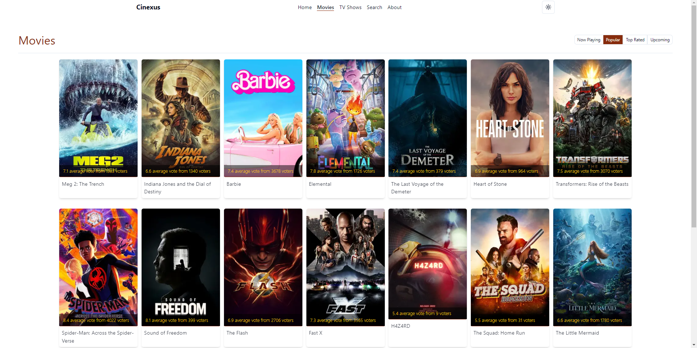

**Live at:**   https://cinexus-sepia.vercel.app/

##### Steps to setup locally

* Clone the project.
* Run "npm install"
* Run "cp .env.example .env.local"
* Sign up to your own tmdb account to get the required api key and api read access token and add them to the .env.local file.
* Run "npm run dev"

##### Demo

Lighthouse Score

